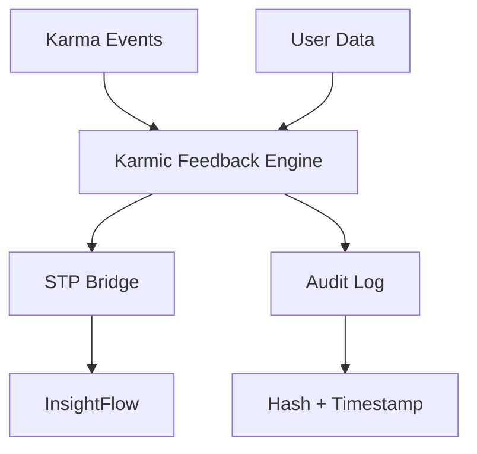
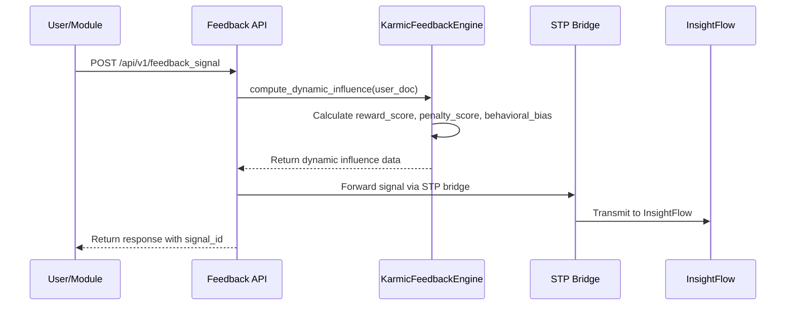

# Karmic Feedback Engine Guide

## Overview

The Karmic Feedback Engine is a core component of KarmaChain v2.2 that computes net karmic influence and publishes it as telemetry to InsightFlow. It implements the formula: **dynamic influence = reward_score – penalty_score ± behavioral bias**.

## Architecture



### Core Components

1. **KarmicFeedbackEngine** (`utils/karma_feedback_engine.py`)
   - Computes dynamic influence using the formula: reward_score – penalty_score ± behavioral bias
   - Aggregates data per user and per module
   - Integrates with the existing karma engine for net karma calculations

2. **STP Bridge** (`utils/stp_bridge.py`)
   - Configurable Signal Transmission Protocol bridge for forwarding signals to InsightFlow
   - Implements retry logic and timeout handling
   - Provides health check functionality

3. **Feedback API** (`routes/feedback.py`)
   - RESTful API endpoints for computing and publishing feedback signals
   - Batch processing support for multiple users
   - Health and configuration endpoints

## Data Flow



## Implementation Details

### Dynamic Influence Calculation

The engine computes dynamic influence using the formula:

```
dynamic_influence = reward_score – penalty_score ± behavioral_bias
```

Where:
- **reward_score**: Sum of positive karma tokens (DharmaPoints, SevaPoints, PunyaTokens)
- **penalty_score**: Weighted sum of negative karma tokens (PaapTokens with severity multipliers)
- **behavioral_bias**: Adjustment based on recent activity patterns and consistency

### Reward Score Calculation

```python
reward_score = sum(balances.get(token, 0) for token in ["DharmaPoints", "SevaPoints", "PunyaTokens"])
```

### Penalty Score Calculation

```python
penalty_score = 0
for severity in paap_tokens:
    if severity in TOKEN_ATTRIBUTES["PaapTokens"]:
        multiplier = TOKEN_ATTRIBUTES["PaapTokens"][severity]["multiplier"]
        penalty_score += paap_tokens[severity] * multiplier
```

### Behavioral Bias Calculation

The behavioral bias accounts for patterns in user activity:
- Consistency of positive actions
- Recent activity trends
- Module-specific behavior patterns

## API Endpoints

### Compute and Publish Feedback Signal
```
POST /api/v1/feedback_signal
Content-Type: application/json

{
  "user_id": "user123",
  "module": "insight",
  "context": "dashboard_view"
}
```

Response:
```json
{
  "status": "success",
  "data": {
    "signal_id": "sig_abc123",
    "user_id": "user123",
    "module": "insight",
    "influence_data": {
      "dynamic_influence": 15.7,
      "reward_score": 25.0,
      "penalty_score": 8.5,
      "behavioral_bias": -0.8,
      "timestamp": "2023-01-01T12:00:00Z"
    }
  }
}
```

### Get Feedback Signal for User
```
GET /api/v1/feedback_signal/{user_id}
```

### Batch Process Multiple Users
```
POST /api/v1/feedback_signal/batch
Content-Type: application/json

{
  "user_ids": ["user123", "user456"],
  "module": "insight"
}
```

### System Health Check
```
GET /api/v1/feedback_signal/health
```

### Get Engine Configuration
```
GET /api/v1/feedback_signal/config
```

## Configuration

The Karmic Feedback Engine can be configured through environment variables:

| Variable | Description | Default |
|----------|-------------|---------|
| `STP_BRIDGE_URL` | URL for the InsightFlow endpoint | `http://localhost:8001/api/v1/insightflow` |
| `STP_RETRY_COUNT` | Number of retry attempts | `3` |
| `STP_TIMEOUT` | Request timeout in seconds | `30` |
| `STP_BATCH_SIZE` | Maximum batch size for signals | `100` |

## Audit Logging

Every signal transmission is logged in `audit.log` with:
- SHA-256 hash of the signal data
- ISO8601 timestamp
- Signal ID and metadata

Example log entry:
```
{
  "timestamp": "2023-01-01T12:00:00Z",
  "event_type": "feedback_signal",
  "signal_id": "sig_abc123",
  "user_id": "user123",
  "hash": "a1b2c3d4e5f6...",
  "module": "insight"
}
```

## Integration with InsightFlow

The STP (Signal Transmission Protocol) Bridge forwards karmic influence deltas to InsightFlow:

1. **Signal Packaging**: Feedback signals are packaged with metadata
2. **Transmission**: Signals are sent via HTTP POST to the InsightFlow endpoint
3. **Retry Logic**: Failed transmissions are retried up to `STP_RETRY_COUNT` times
4. **Health Monitoring**: Bridge health is monitored via the `/health` endpoint

## Testing

Unit tests are available in `tests/test_feedback_engine.py` and cover:
- Dynamic influence calculation
- Reward and penalty score computation
- Behavioral bias calculation
- STP bridge functionality
- API endpoint validation

Integration tests are available in `scripts/test_feedback_api.py`.